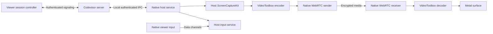

# Native Screen Sharing implementation plan

Status: Native macOS viewing and interactive control are implemented, including bounded explicit text clipboard transfer, captured-cursor fallback, adaptive capture quality, connection diagnostics, optional host-issued STUN/TURN credentials and lease-bound media replacement after network loss. Local native media, UI and authenticated signaling checks pass. Exploratory two-Mac media runs and hardware HEVC 4:4:4 probes now pass on tuftlord (M1 Pro) and the local M4 Max. Transport-loss recovery before an idle desktop (in-band frame identity, host idle notice, viewer delivery audit with a 100 ms threshold, 100 ms grace and up to four progress extensions) is implemented and measured locally through an encrypted UDP relay. The controlled LAN/Apple latency comparison, forced-TURN/network-restriction checks and a completed source artifact/notice audit remain open. The iOS viewer and audio/HEVC/fidelity expansions remain later milestones. See [the implementation and measured results](../../packages/swift/ScreenSharing/README.md).

Build Screen Sharing as a native Codevisor feature alongside Terminal: a persistent workspace pane with a native video surface, native input, and a session controller. The first-party designation does not constrain this feature to the HTTP plugin protocol or a webview.

**Scope and sequence**

The first usable milestone is one Codevisor Mac viewing and controlling an existing display on another Codevisor Mac over the LAN. Use Apple silicon Macs as the initial performance reference. The host must have the native app running in the logged-in session and the necessary macOS permissions. The workspace's machine is the host; this version does not introduce an arbitrary-host connection manager.

The initial beta supports one active media viewer per host. A second viewer gets an explicit in-use state and cannot displace the first. Persisting the same pane on several devices does not automatically attach every device. Multiple simultaneous viewers can follow once resource sharing and control handoff are implemented.

Next come internet connectivity and native iOS viewing/control, followed by audio and additional fidelity work. Virtual displays, independent login sessions, access before login, Apple VNC interoperability, file transfer, and non-macOS hosts are separate follow-up scope. HEVC and 4:4:4 are capability investigations; they are not prerequisites for the first H.264-based milestone.

**Architecture**

The encoder and decoder integrate through WebRTC's native codec interfaces; the diagram describes ownership, not a second encoding pass. Frames stay in native memory. SwiftUI observes connection state and renders controls, while the video surface consumes decoded frames directly.

| Owner                                     | Responsibility                                                                                                                                                                                                                                                                                                |
| ----------------------------------------- | ------------------------------------------------------------------------------------------------------------------------------------------------------------------------------------------------------------------------------------------------------------------------------------------------------------- |
| New `CodevisorScreenSharing` Swift target | Versioned native messages, viewer/session state, media interfaces, VideoToolbox adapters, Metal surface, metrics. No dependency on application pane classes. Its WebRTC-free foundation and the backend seams are described in [the composable architecture plan](screen-sharing-composable-architecture.md). |
| `CodevisorCoreMac`                        | Host capture, permissions, display enumeration, input injection, native host service and its lifecycle.                                                                                                                                                                                                       |
| `CodevisorCore` and `CodevisorClient`     | Pane identity, workspace synchronization, authenticated capability/session requests, signaling integration.                                                                                                                                                                                                   |
| macOS app                                 | `ScreenSharingPane`, `NSView` responder behavior, commands, focus and pane lifecycle.                                                                                                                                                                                                                         |
| iOS app, in a later milestone             | Native `UIView` surface, touch mapping, hardware/software keyboard handling and background lifecycle.                                                                                                                                                                                                         |
| TypeScript server                         | Capability discovery, session authorization and signaling proxy to the native host. Existing workspace persistence. Video does not traverse its JSON tool bridge.                                                                                                                                             |

Use native WebRTC as the proposed media transport, with encrypted RTP media and data channels. Existing Codevisor HTTP/WebSocket connections carry signaling, including when signaling is relayed. Bind the negotiated peer fingerprint and session generation to that authenticated exchange. The existing cloud relay and direct LAN connection are WebSocket-based; neither is a TURN server or a UDP media path.

Milestone 0 must establish the native WebRTC dependency: pinned upstream revision, macOS/device/simulator slices required by our builds, repeatable artifact build, checksums, notices, signing integration, and a supported codec adapter path. Reuse existing dependency-artifact conventions. Do not select an unversioned binary or design around an untested codec hook. A material transport change after this investigation requires an updated design record, not an implicit substitution with TCP video.

**What the repository already provides**

| Existing code                                                                                                                                                                                                                                                                    | Reuse and required change                                                                                                                                                                 |
| -------------------------------------------------------------------------------------------------------------------------------------------------------------------------------------------------------------------------------------------------------------------------------- | ----------------------------------------------------------------------------------------------------------------------------------------------------------------------------------------- |
| [PaneGroupState.swift](../../packages/swift/CodevisorCore/Sources/CodevisorCore/Panes/PaneGroupState.swift), [Pane.swift](../../apps/macos/Codevisor/Features/Panes/Pane.swift), [TerminalPane.swift](../../apps/macos/Codevisor/Features/Panes/TerminalPane.swift)              | Add `.screenSharing` and use the existing creation, focus, visibility, detach and delete hooks. Preserve expensive session state across view reconstruction and tab moves.                |
| [WorkspaceSyncModel+ServerRecords.swift](../../packages/swift/CodevisorCore/Sources/CodevisorCore/ViewModels/WorkspaceSyncModel+ServerRecords.swift), [workspaces.ts](../../packages/api/src/workspaces.ts)                                                                      | Add native pane serialization and versioned metadata. The registry already accepts provider/type strings and opaque metadata; a database schema change is not expected for pane identity. |
| [ComputerUseRecording.swift](../../packages/swift/CodevisorCoreMac/Sources/CodevisorCoreMac/Server/ComputerUseRecording.swift), [ComputerUseVideoWriter.swift](../../packages/swift/CodevisorCoreMac/Sources/CodevisorCoreMac/Server/ComputerUseVideoWriter.swift)               | Reuse capture/filter/permission knowledge. Add a live encoder; the current MP4 writer and recording duration limits are not a live-stream interface.                                      |
| [ComputerUseBridge+Keyboard.swift](../../packages/swift/CodevisorCoreMac/Sources/CodevisorCoreMac/Server/ComputerUseBridge+Keyboard.swift), [ComputerUseBridge+Mouse.swift](../../packages/swift/CodevisorCoreMac/Sources/CodevisorCoreMac/Server/ComputerUseBridge+Mouse.swift) | Reuse applicable key/coordinate primitives. Add continuous input state and delivery; current automation actions contain waits and target individual apps/windows.                         |
| [LocalCodevisorServer.swift](../../packages/swift/CodevisorCoreMac/Sources/CodevisorCoreMac/Server/LocalCodevisorServer.swift)                                                                                                                                                   | Own host-service startup and shutdown alongside the native bridge. A running standalone server must report unavailable when the native host is absent.                                    |
| [CloudDirectConnection.swift](../../packages/swift/CodevisorCloud/Sources/CodevisorCloud/CloudDirectConnection.swift), [CloudChannelTransport.swift](../../packages/swift/CodevisorCloud/Sources/CodevisorCloud/CloudChannelTransport.swift)                                     | Reuse authenticated machine routing and signaling infrastructure. Add media connectivity separately.                                                                                      |

**Pane and session contract**

- Publish `providerId: "codevisor"`, `paneType: "screen-sharing"`. Store metadata with `schemaVersion: 1`, an optional preferred display identity, and fit/actual-size preference. The workspace supplies machine identity. Resolve a persistent display identity against current displays; never silently redirect input to a different display when it disappears.
- Keep the shared pane descriptor separate from device-local visibility/focus and ephemeral viewer/session identifiers. Never persist SDP, credentials, control leases, or live frames in the workspace registry. Disable durable screen thumbnails for this pane initially.
- Add capability discovery and a typed, versioned session-signaling channel under the existing authenticated machine API. Requests identify the workspace, pane and connection-local viewer. The native host validates display selection, codec limits and view/control entitlement before starting capture or accepting input.
- States: idle, connecting, viewing, controlling, suspended, reconnecting, unavailable and failed. Only a live, focused viewer with an active control lease can inject input. Use connection generations to reject late callbacks and messages from previous sessions.
- Creating/restoring an inactive pane does not capture. Selecting it can establish viewing. Control is an explicit mode. Hiding the pane releases held input and the control lease immediately, pauses media and retains session identity. Showing it resumes viewing with a fresh decodable frame; control is reacquired explicitly.
- Moving a tab or rebuilding its view does not destroy the session. Closing/detaching cancels pending work and stops its stream. Host capture stops when there is no active viewer. The host exposes a native stop action; a stop or permission revocation releases all injected keys/buttons.
- Network loss, screen lock, display removal, app shutdown and permission loss suspend input immediately. On reconnection, reacquire capability/display state and negotiate a fresh generation before resuming viewing. No queued input is replayed.
- Newer clients must round-trip the descriptor; older clients must ignore the unsupported pane without deleting its server record or losing sibling tabs. Compile both apps when adding the enum case, with an explicit unavailable presentation on iOS until its renderer lands.

**Input and media behavior**

Use reliable ordered delivery for key/button transitions, control ownership and release-all messages. Coalesce expendable pointer-motion updates separately. Button events carry their own coordinates and display generation so an unordered motion update cannot change a click's target. Scroll events carry sequence/cumulative information so coalescing does not lose movement. Track every held key/button on the host and release it on disconnect or lease expiration.

Map video content coordinates through letterboxing, source pixel dimensions, display scale, rotation and global display origin, including negative origins. Separate physical key events from committed Unicode text. Define a visible local/remote shortcut mode and an always-local escape command before wiring application command handling. OS-reserved shortcuts require explicit testing; native input does not imply every shortcut is interceptable.

Use bounded capture/encode/render queues and low-delay codec settings. Drop stale raw frames before encoding, and recover decoder reference state through the transport/codec layer rather than dropping arbitrary compressed packets. Apply encoder bitrate changes from congestion feedback and reduce resolution/frame rate when necessary. Keep color-space/range metadata end to end; render at backing-pixel resolution for text clarity.

Investigate cursor shape, hotspot and position updates during Milestone 0. Use a local cursor overlay only when synchronization is correct. Until that is proven, capture the host cursor and suppress duplicate overlays; this is an explicit prototype limitation, not a claim of final native fidelity.

**Implementation milestones**

| Milestone                          | Concrete deliverable                                                                                                                                                                                                                                                       | Exit criterion                                                                                                                                                                                                                                                     |
| ---------------------------------- | -------------------------------------------------------------------------------------------------------------------------------------------------------------------------------------------------------------------------------------------------------------------------- | ------------------------------------------------------------------------------------------------------------------------------------------------------------------------------------------------------------------------------------------------------------------ |
| **0. Prove the native media path** | Add the isolated media target and reproducible WebRTC dependency. Feed synthetic and live display frames through capture → encoder → transport → decoder → Metal. Probe H.264/HEVC hardware use, profile/pixel-format support, cursor access and native input feasibility. | Repeatable two-Mac LAN demonstration with codec, format, hardware/software path and latency results recorded. H.264 provides a working baseline. Resolve the transport adapter and cursor approach before the interactive beta.                                    |
| **1. Native viewing tab**          | Add `.screenSharing`, metadata and sync mappings, New Tab entry, native host capabilities/signaling, viewer state machine, display selection, fit/actual-size, connection status and native surface. Keep feature exposure gated until the slice works.                    | Open a tab on Mac A in Mac B's workspace and see B's selected display. Switching/splitting/moving/restoring tabs preserves identity; hidden tabs stop capture work; closing cleans up. Older servers and absent native hosts show an actionable unavailable state. |
| **2. Interactive LAN beta**        | Add control mode, continuous input, shortcut routing, Retina/multiple-display coordinate handling, cursor behavior, basic text clipboard, lease recovery and host stop control.                                                                                            | Complete real editing, terminal and browser interactions. No stuck keys/buttons after loss of focus, disconnect, lock, host stop or display change. Meet the measured LAN targets below or document a revised target with the observed bottleneck.                 |
| **3. Internet connectivity**       | Add STUN/TURN configuration and short-lived relay credentials, ICE restart, authenticated peer binding, adaptive quality and diagnostic connection stats. Media remains encrypted through TURN.                                                                            | Connect across separate networks, including a forced TURN route and UDP-restricted network. Recover after a route change without stale frames/input. Record relay bandwidth and cost assumptions; never put fixed TURN secrets in the client.                      |
| **4. Native iOS viewer**           | Reuse media/session interfaces; add native rendering, explicit pointer/scroll gestures, hardware keyboard and text entry, rotation and background handling.                                                                                                                | Physical-device tests against a Mac host verify rendering, input mapping and reconnection. Backgrounding releases control and suspends media. Existing iOS workspace behavior remains intact.                                                                      |
| **5. Fidelity and expansion**      | Evaluate HEVC preference, 4:4:4 alternatives, HDR, synchronized audio, multiple simultaneous viewers/displays and optional virtual-display work.                                                                                                                           | Promote each capability only after hardware/OS negotiation, text/color fidelity, latency and resource measurements pass. Separate login sessions remain their own architectural investigation.                                                                     |

Milestones are sequential at their interfaces. Milestone 0 can be split into dependency/protocol and codec/rendering changes; Milestones 1 and 2 should land as small reviewable changes around a working vertical slice. No staffing or multi-agent parallelism is assumed.

**Implementation checklist**

- [x] Native ScreenCaptureKit → VideoToolbox H.264 → WebRTC → hardware decoder → Metal path.
- [x] Native workspace pane, persisted display/size preferences and authenticated signaling.
- [x] Explicit control, bounded input queues, held-input release and always-local release shortcut.
- [x] Explicit plain-text clipboard transfer over an independent bounded channel.
- [x] Supported captured-cursor fallback with duplicate viewer cursor suppression.
- [x] Connection details and text-first adaptive resolution/frame-rate policy.
- [x] Optional STUN/TURN configuration and short-lived host-issued relay credentials.
- [x] Fresh media/ICE/DTLS generation for interrupted sessions, bound to the existing host lease.
- [x] Thirty-minute local media endurance run, live quality transitions and authenticated host recovery checks recorded in the [measurement report](../measurements/native-screen-sharing-2026-09-10/README.md).
- [x] Correct physical-presentation accounting; per-second WebRTC delay metrics and bounded renderer scheduling experiment.
- [x] Public-API hardware HEVC 4:4:4 codec probes on M1 Pro and M4 Max, plus bidirectional native media experiments; see the [tuftlord report](../measurements/native-screen-sharing-tuftlord-2026-09-10/README.md).
- [x] Tuftlord Screen Recording grant verified; real-desktop 1080p/4K capture runs and a shared Apple/native workload recorded, with explicit network and presentation limits.
- [x] Exploratory matched-scale 4K Apple High Performance / Codevisor comparison: two recordings per viewer, a local recording control, frame-code analysis and stage diagnostics; see the [September 11 report](../measurements/native-screen-sharing-apple-2026-09-11/README.md).
- [x] Bounded capture/encoder/decoder cadence diagnostics and a probe-only VT rate-control comparison; see the [timing investigation](../measurements/native-screen-sharing-timing-2026-09-11/README.md). Product rate-control and renderer defaults remain unchanged.
- [x] Correct the synthetic input-format description and compare explicit BGRA/NV12 sources across both rate controllers; see the [pixel-format investigation](../measurements/native-screen-sharing-pixel-format-2026-09-11/README.md). Isolated colored-text and full media results favor different modes, so desktop validation remains required.
- [x] Explicit native HEVC/Main444 transport and NV24 rendering in the probe, Release builds, scoped capture picker and bounded pipeline experiments; see the [pipeline report](../measurements/native-screen-sharing-pipeline-2026-09-11/README.md). Performance parity and product codec promotion remain open; the September 15 [rig record](screen-sharing-rig.md) attributes the Main444 stalls to keyframe pacing and removes them on the LAN with a pacer multiplier.
- [x] Keep requested recovery keyframes pending across encoder admission drops; explicit decoder-state-loss checks pass for H.264 and Main444, including 4K encoder backpressure. This is local fault injection, not loss acceptance on a real network.
- [x] Pinned source-build recipe and manual artifact workflow prepared; published dependency checksum/slices verified.
- [x] Complete the pinned source build with Xcode 26.6 and audit generated third-party notices: all five architectures, source-license text checks, slices/signatures/privacy/dSYM inspection, 180 unchanged media tests against the isolated candidate, and a native factory/peer smoke passed September 14. The toolchain pin deliberately changed from 26.5, and on September 15 moved to 27.0 because no development Mac still has 26.6; the recipe completed on 27.0 the same day (archive SHA-256 `85cfef48…`, headers and notices byte-identical to the audited ones, media tests and smoke not repeated). WebRTC source and the installed dependency are unchanged. See the [MVP checkpoint](native-screen-sharing-mvp.md).
- [x] Integrate the audited notices into product packaging. The combined macOS build and unpublished Developer ID ZIP/DMG verification passed; notices retain the audited hashes. See the [MVP checkpoint](native-screen-sharing-mvp.md) for toolchain, Intel-runtime and notarization limits.
- [x] Install the source-built WebRTC as the product dependency: the Xcode 27.0 build is published as `851-labs/webrtc` `152.0.0-codevisor.1` and pinned in the Swift package and both Xcode workspaces (September 15) after isolated and in-repo media tests and a macOS build passed. No performance or byte-reproducibility claim is made against the stasel build.
- [ ] Run the specified two-Mac LAN editing/terminal/browser and input-to-photon checks, including rotated/external displays and non-US input methods.
- [ ] Validate separate networks, forced TURN, UDP restrictions and route changes against a deployed relay.
- [ ] Complete isolated wired-LAN and 30-minute resource/latency comparisons, matched 1080p Apple runs, quantitative text fidelity and external input-to-photon measurements.
- [ ] Native iOS viewer/control and physical-device validation (Milestone 4).
- [ ] HEVC, audio, HDR and other fidelity expansions (Milestone 5).

The recovery implementation replaces the whole native peer while retaining host authorization, instead of invoking ICE restart inside an existing peer. This deliberately discards queued media/input and renegotiates fresh codec state. Host stop and the original lease deadline apply across asynchronous teardown and display enumeration.

**Measurement and validation**

Initial engineering targets for Milestone 2, to validate in Milestone 0: two specified Apple silicon Macs on wired gigabit LAN, SDR 1920×1080 at a requested 60 fps, one viewer, continuously changing content, warmed hardware codecs. Aim for at least 55 presented frames/second and p95 input-to-visible-response at or below 100 ms. These are proposed acceptance targets, not current measurements or a promise of Apple parity. Record a separate 4K/text workload without claiming the same throughput.

Instrument capture, encode, send, receive, decode and presentation timestamps, queue depth, dropped frames, codec/profile/pixel format, hardware use, bitrate, CPU/GPU utilization and memory. Keep timestamps monotonic within each process. Do not subtract unrelated host/viewer clocks: use an external input-to-photon recording or a calibrated method with stated clock error. Run the identical workload in Apple's High Performance mode for comparison. A 30-minute run must show bounded queues, stable resource usage and no accumulating latency.

Correctness tests use the existing `TestClock`/`TestSignal` fixtures and injected media/input transports. Cover pane metadata round-trips and mixed versions, authorization and session generations, out-of-order callbacks, bounded queues, coordinate transforms, held-input release, visibility, cancellation, reconnects and idempotent teardown. Hardware capture/codec and real-socket tests stay in focused integration suites. Permission prompts and performance comparisons do not run in ordinary unit tests. Follow [deterministic-tests](../../.agents/skills/deterministic-tests/SKILL.md).

Each implementation change runs affected Swift and TypeScript tests/typechecks and relevant formatting/lint checks. Build both native apps when shared pane or media interfaces change using `bun run build:macos` and `bun run build:ios`, following [build-codevisor](../../.agents/skills/build-codevisor/SKILL.md). Use the run-dev and ios-development workflows for interactive validation when those milestones are implemented. The initial implementation has passed both native app builds and the focused media tests; see the implementation README for current validation and limits.

**Technical decisions to resolve in Milestone 0**

1. Can the pinned native WebRTC build expose the required pixel buffers and low-delay VideoToolbox controls without a large fork? Record the chosen adapter and its maintenance/build footprint.
2. Which codec/profile/format combinations actually use hardware on the supported machines? Establish H.264 first; native access alone does not establish HEVC 4:4:4 support.
3. How are cursor shape/position and remote keyboard shortcuts obtained reliably with the chosen APIs? Record limitations and the prototype fallback.
4. What dominates observed latency: capture, codec buffering, transport, decode or presentation? Optimize the measured stage and confirm text quality before adding resolution or features.

The next Milestone 0 work is capture/encoder pacing and receive-buffer profiling, the remaining controlled comparisons, and dependency-build checks. Tuftlord is available over authorized SSH, and exploratory native media runs in both directions are recorded. For the original recording comparison, Apple Screen Sharing's connection settings confirmed High Performance with one virtual display at 1920×1080 points / 4K backing pixels and 60 Hz. Local `replayd` descriptor exhaustion was diagnosed and capture recovered. The [September 11 comparison](../measurements/native-screen-sharing-apple-2026-09-11/README.md) now records approximately 53.9 sampled updates/s for Apple versus 38.9–39.7 for Codevisor, using matching 4K source and viewer content size. A local recording control observed 57.4 updates/s at a requested 60 fps. These are recording observations, not physical presentation or input-to-photon measurements. Current runs used a Wi-Fi/Ethernet environment with Tailscale active, and Apple continued streaming during Codevisor trials to supply the virtual display; the specified isolated wired-LAN setup remains open.

The [timing follow-up](../measurements/native-screen-sharing-timing-2026-09-11/README.md) adds stage cadence, VT submit-call timing and encoder-drop diagnostics. A standard-rate-control experiment improved local synthetic 4K presentation from 43.7–44.6 to 48.1–48.3 fps, without a consistent receive-buffer reduction. It remains probe-only. Tuftlord's attempted follow-up was invalidated by a protected keychain dialog and severe competing load; the dialog later cleared but the load remained high. Resume valid desktop/bitrate trials on a quiet host before promoting a rate-control or transport change.

That initial local source was BGRA, incorrectly described as NV12 in the first timing report. The [pixel-format follow-up](../measurements/native-screen-sharing-pixel-format-2026-09-11/README.md) corrects the report and adds measured preconversion before WebRTC. In repeated local 4K media runs, NV12/standard reaches 48.7–52.4 fps versus 44.1–44.9 for NV12/low-latency. The isolated colored-text codec test instead favors NV12/low-latency, encoding all 180 opportunities versus 122–135 for NV12/standard. Neither workload reproduces the earlier desktop receive buffering. Production already captures NV12 and retains low-latency rate control. Tuftlord remained heavily loaded at the final check, so the instrumented real-desktop comparison is still open.

The measured architecture decision is to retain WebRTC as the current baseline, investigate real-capture pacing/receive buffering alongside HEVC 4:4:4 integration and presentation scheduling, and only pursue a replacement transport when measurements establish a material limit. Frame arrival improved the revised desktop workload to 56.58 presented fps with 29.57 ms renderer p95, versus 52.14 fps / 35.24 ms for display-link scheduling. Earlier synthetic experiments worsened p95 and the network conditions varied, so it remains probe-only. The initial real-desktop 4K run reached 37.03 fps, with a 93.66 ms average of sampled receive-buffer interval means. These are not input-to-photon measurements or isolated Apple comparisons. The later probe now negotiates HEVC/Main444 through the pinned transport and validates full-chroma decode, but 4K60 product performance and Apple parity remain unproven. The Apple session subsequently disconnected, then reconnected through the verified local hostname without entering credentials. High Performance with one virtual display was selected; the restored display was verified as 4K/60 Hz. Current follow-up work uses a shared synthetic text source to separate capture from encoding, transport and presentation; see the [pipeline report](../measurements/native-screen-sharing-pipeline-2026-09-11/README.md).

The next isolation test reproduced the desktop Main444 slowdown with a synthetic source while Apple streamed a separate visible workload: 20.45 fps and 124.16 ms median VT completion. After closing Apple, the first interval reached 56.95 fps and 39.20 ms median completion, but later packet loss and ICE route changes invalidated a clean full-run comparison. Restricting exchanged candidates to verified LAN interfaces is now a labeled diagnostic option. Apple was deliberately disconnected for this control; its virtual display disappeared. Match source/display geometry again before a fresh Apple comparison. Current product codec, keyframe interval and renderer defaults remain unchanged.

A subsequent [separate-stream comparison](../measurements/native-screen-sharing-independent-2026-09-11/README.md) removes concurrent Apple encoding during Codevisor capture. The Main444 candidate recorded 50.23/47.30 distinct updates per second; fresh Apple High Performance samples recorded 49.89/49.84. Both used the same 4K workload and local viewer content size, but Codevisor captured a window while Apple streamed a virtual display. Codevisor had longer worst-case update gaps (70/158 ms versus 47/42 ms). Average update rate is close in this setup; smoothness, interaction latency, text fidelity and sustained behavior still need validation. A subsequent 72 Hz display-link experiment reduced presentation cadence and remains diagnostic. A two-drawable trial encountered a seven-second media interruption with a selected ICE-pair change, so it does not isolate renderer behavior. The subsequent calibrated series joins visible marker codes to exact source draw timestamps using bracketing clock calibrations, with a local capture control and explicit clock uncertainty.

The first [calibrated image-age samples](../measurements/native-screen-sharing-independent-2026-09-11/image-age/README.md) now measure source AppKit draw start to a local capture of the viewer: Codevisor median/p95 is 135.46/166.98 ms, versus Apple High Performance at 130.79/141.42 ms, with clock bounds of approximately ±1.90/±2.22 ms. Both used 960×540-pixel content on the same secondary 60 Hz display. Codevisor's longer tail and update gaps remain the measured gap; this is not physical input-to-photon or controlled sustained parity. Exact source timestamps, numeric window observation, clock responders and explicit probe monitor placement are implemented and validated without changing product defaults.

The following zero-delay WebRTC playout trial reduced median image age to 109.41 ms, but p95 remained 165.04 ms and sampled updates 52.05/s, versus Apple's earlier 141.42 ms and 57.84/s. Selecting frames after drawable acquisition lowered median further while worsening cadence and long gaps; the original selection order was restored. A probe-only CAMetalDisplayLink driver passed a local recovery control and both native builds. The next comparison uses a composited-display crop to avoid treating independent window updates as proof of visible scanout; physical input-to-photon, fidelity and sustained parity remain open.

**Primary technical references**

- [Apple: ScreenCaptureKit](https://developer.apple.com/documentation/screencapturekit) — capture framework and content selection.
- [Apple: low-latency VideoToolbox encoding](https://developer.apple.com/videos/play/wwdc2021/10158/) — hardware H.264 low-delay configuration; do not assume the same settings apply to every HEVC encoder.
- [Apple: Core Video and Metal textures](https://developer.apple.com/documentation/CoreVideo/cvmetaltexturecache-q3j) — GPU access to decoded image buffers.
- [WebRTC: native development](https://webrtc.github.io/webrtc-org/native-code/development/) and [native iOS builds](https://webrtc.googlesource.com/src/+/main/docs/native-code/ios/) — native integration and framework build starting points; verify against the pinned revision.
- [WebRTC: TURN](https://webrtc.org/getting-started/turn-server) — relayed media connectivity.
- [Apple: High Performance mode](https://support.apple.com/en-ie/guide/mac-help/mchl1883115d/mac) — comparison feature set; reproducing its proprietary protocol is outside this plan.

The [display-crop controls](../measurements/native-screen-sharing-independent-2026-09-11/display-age/README.md) now validate source-draw timestamps and nonzero viewer crop coordinates on the laptop display. Remote comparisons were correctly excluded when the viewer moved offscreen during warmup; they establish no parity result. Background work hardened keyframe requests through VT output failure and added a headless recovery check. The 49 media tests, both native builds, local H.264 recovery and local 4K Main444 recovery pass; see the [recovery record](../measurements/native-screen-sharing-independent-2026-09-11/recovery/README.md).

Recovery is now verified with one admitted forced output deliberately discarded after decoder reset: local H.264, local 4K Main444 and tuftlord 4K Main444 all recovered with two transport requests and three forced submissions. Recovery times were 32.39, 61.94 and 53.84 ms, respectively. This is an application callback fault, not induced network loss or an internal VT failure. The final 50-test media suite and both native builds pass.

The [idle recovery investigation](../measurements/native-screen-sharing-independent-2026-09-11/idle-source/README.md) reproduced a static-screen freeze after decoder reset: no replacement frame arrived before the twelve-second run ended. A bounded, separately negotiated refresh data channel now requests a forced keyframe from a one-buffer capture cache. Retries run only while recovery is pending and stop after a valid keyframe decodes. Local H.264 and 4K Main444 idle checks recovered in 9.19/28.22 ms, and tuftlord's 4K Main444 check recovered in 33.14 ms. Discarding the first recovery output still recovered in 119.78 ms locally and 124.22 ms on tuftlord. All checks settled with unchanged encoded-frame and request counts. These are headless functional checks; sustained SCK buffer pressure, actual network loss and visible Apple parity remain open. The media suite passes 57 tests, including fake-clock retry/cancellation and stale-callback ordering.

Both native app builds and the Release probe pass after the idle-refresh change. Next background gate: inject loss in the actual encrypted UDP media path, including a lost frame followed by source idle, and verify that transport-only feedback can cause a fresh frame. A decoder-reset check alone does not prove that case.
