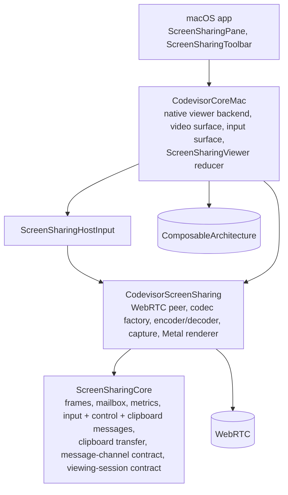

# Screen Sharing composable architecture

Status: Implemented on `screen-sharing-composable-architecture`; the native path was tophatted in the dev app (connect, Fit/Actual Size, hide and re-show reconnect with the persisted preference, Connection Details, Clipboard menu). This refactor keeps the shipped Mac-to-Mac path behavior-identical and cuts the seams a second backend (a standard VNC/RFB viewer) plugs into later. No VNC code lands here. See [the native implementation plan](native-screen-sharing.md) for the shipped feature and [the media package README](../../packages/swift/ScreenSharing/README.md) for measured results.

**Why**

`CodevisorScreenSharing` is a WebRTC pipeline end to end: ScreenCaptureKit → VideoToolbox → SRTP, three negotiated SCTP channels, one-shot SDP over the Codevisor server. The viewer seam (`ScreenSharingViewingPeer`) is SDP-shaped (`offer()`/`accept(answer)`), the video surface is constructed from a `ScreenSharingPeer`, the Metal renderer accepts only biplanar YCbCr, and the viewer model hand-rolls signaling, heartbeats, recovery and cancellation with a generation counter. A VNC viewer shares nothing on the wire with any of that, so today it could only be added by faking SDP strings and CPU-converting RGB to NV12.

**Two altitudes, not one plugin per layer**

A plugin per layer (`Capture × Codec × Transport × Input`) is right for the native path, where the stages are genuinely separable, and wrong for RFB, where encoding, transport and decoding are fused inside one protocol. The architecture therefore has two altitudes:

1. **Session contracts** — what the feature depends on. A viewing session exposes frames, control, clipboard and diagnostics as optional capabilities. Backends implement this; the feature never learns which one it is talking to.
2. **Pipeline toolkit** — capture sources, codecs, the WebRTC peer, the Metal renderer, input translation. Backends compose from it. The native backend uses all of it; a VNC backend would use the renderer, the input surface and the clipboard transfer, and bring its own protocol module.

One further cut governs where each technique applies. The **control plane** (visibility, display choice, connect/reconnect/stop, lease requests, failure messages) changes a few times a minute and is where a reducer, dependency injection and exhaustive tests pay off. The **data plane** (60 fps frames, ~1 kHz input, 1 Hz lease heartbeats, clipboard chunks) stays as it is: mailboxes, closures and main-actor objects, no actions per frame.

## Target graph

> Superseded on 2026-09-18. The graph below is the one this branch landed; the targets were later consolidated into three under `packages/swift/ScreenSharing` (`ScreenSharing`, WebRTC-free; `ScreenSharingWebRTC`, the peer; `ScreenSharingTesting`, the loopback RFB server), with the former `ScreenSharingCore`, `ScreenSharingViewer`, `ScreenSharingVNC`, `ScreenSharingRFB` and `ScreenSharingHostInput` targets becoming folders of `ScreenSharing`. The rule this section states, that a VNC backend never depends on WebRTC, is now enforced by linkage rather than by a comment: `ScreenSharing` does not link the framework. Current layout: [the engine README](../../packages/swift/ScreenSharing/README.md).



`ScreenSharingCore` links no WebRTC, Metal, ScreenCaptureKit or AppKit. `CodevisorScreenSharing` re-exports it (`@_exported import ScreenSharingCore`), so every existing `import CodevisorScreenSharing` keeps compiling. The rule the graph enforces: a future `ScreenSharingVNC` target depends on `ScreenSharingCore` and never on `CodevisorScreenSharing`; the build fails if it tries.

Files that move into `ScreenSharingCore` (unchanged content, `git mv`): `ScreenSharingVideoConfiguration` (error, configuration, `ScreenSharingVideoFrame`, `ScreenSharingFrameMailbox`), `ScreenSharingControlMessage`, `ScreenSharingClipboardMessage`, `ScreenSharingClipboardTransfer`, `ScreenSharingMetrics` (+Presentation), `ScreenSharingFrameDeliveryAudit`, `ScreenSharingFrameIdentity`, `ScreenSharingScrollAccumulator`. Everything that imports WebRTC, VideoToolbox, MetalKit or ScreenCaptureKit stays.

## Contracts

All contracts live in `ScreenSharingCore`.

```swift
/// An ordered, reliable, bounded message channel. Today: one negotiated SCTP
/// data channel. Later: a TCP side channel, a WebSocket via the server, or an
/// in-memory pair in tests.
@MainActor
public protocol ScreenSharingMessageChannel<Message>: AnyObject {
  associatedtype Message: Sendable
  var isAvailable: Bool { get }
  var onMessage: ((Message) -> Void)? { get set }
  var onAvailabilityChanged: ((Bool) -> Void)? { get set }
  @discardableResult func send(_ message: Message) -> Bool
  func close()
}

/// In-memory pair for tests and for backends that carry control locally.
@MainActor public final class ScreenSharingLocalChannel<Message: Sendable>: ScreenSharingMessageChannel

public struct ScreenSharingCapabilities: OptionSet, Sendable {
  public static let control, clipboard, statistics: Self
}

/// One live media session as the viewer sees it. No SDP, no signaling, no
/// AppKit: the feature builds its own surface from `frames`.
@MainActor
public protocol ScreenSharingViewingSession: AnyObject {
  var capabilities: ScreenSharingCapabilities { get }
  var frames: ScreenSharingFrameMailbox { get }
  var metrics: ScreenSharingMetrics { get }
  var control: (any ScreenSharingMessageChannel<ScreenSharingControlMessage>)? { get }
  var clipboard: (any ScreenSharingMessageChannel<ScreenSharingClipboardMessage>)? { get }
  /// A terminal media failure (today: the hardware decoder), nil while healthy.
  var failure: String? { get }
  /// Transport state names; "failed", "disconnected" and "closed" are acted on.
  var onConnectionChanged: ((String) -> Void)? { get set }
  func statistics() async -> [String: String]
  func close()
}
```

`ScreenSharingDataChannel` conforms to `ScreenSharingMessageChannel`; `ScreenSharingViewerClipboard` and the viewer control take the protocol. The lease/grant protocol stays a _control-message_ concern layered on any channel; it is the native backend's access model, not a universal. A backend without `.control` in its capabilities never shows a Request Control affordance.

**Backend and endpoint clients** (in `CodevisorCoreMac`, TCA dependencies declared with `@DependencyClient`):

```swift
public enum ScreenSharingViewerEvent: Equatable, Sendable {
  case ended(String)                          // terminal, with the message to show
  case opened(ScreenSharingViewerEndpoint)   // new media to render; replaces any previous endpoint
  case ready                                  // first frame presented
  case reconnecting                           // transport loss; a fresh `opened` follows or `ended`
}

@DependencyClient
public struct ScreenSharingViewerBackend: Sendable {           // installed per pane with `withDependencies`
  public var connect: @Sendable (_ displayId: String) async -> AsyncStream<ScreenSharingViewerEvent>
  public var discover: @Sendable () async throws -> [ServerScreenSharingDisplay]
}

public enum ScreenSharingControlEvent { case availability(Bool), inputLost(String?), message(ScreenSharingControlMessage), sessionFailed(String) }

@DependencyClient
public struct ScreenSharingEndpointClient: Sendable {          // `liveValue` resolves ids in a registry
  public var beginInput: @Sendable (_ endpoint: ScreenSharingViewerEndpoint.ID, _ lease: UUID) async -> String?
  public var controlEvents: @Sendable (_ endpoint: ScreenSharingViewerEndpoint.ID) async -> AsyncStream<ScreenSharingControlEvent>
  public var endInput: @Sendable (_ endpoint: ScreenSharingViewerEndpoint.ID) async -> Void
  public var sendControl: @Sendable (_ endpoint: ScreenSharingViewerEndpoint.ID, _ message: ScreenSharingControlMessage) async -> Bool
}
```

The reducers hold values and endpoint ids; every side effect on an endpoint is an effect through `ScreenSharingEndpointClient`, whose live value looks the id up in the registry each endpoint joins on creation and leaves on close (the pattern TCA uses for per-instance resources such as sockets). Input events stay off the action stream: `ScreenSharingInputForwarder` numbers and sends them under the lease at input rate inside the endpoint, and reports only the loss of forwarding as a control event.

The native `connect` is one main-actor runner per pane: a new discovery or connection awaits the previous connection's teardown, including its authenticated stop, so a stop can never overtake the next start (the ordering the old view model got from awaiting its previous task).

`ScreenSharingViewerBackend.native` owns everything that is Codevisor-server-specific and used to live in the view model: capabilities → offer → `start` → answer → 8 s heartbeats → `stop`, the 3-restart recovery with the same `viewerId`, the "no video after three heartbeats" watchdog and the stop-in-a-fresh-task rule. Cancelling the stream is the only way to end a connection; termination performs the authenticated `stop`.

`ScreenSharingViewerEndpoint` is the main-actor handle the reducer keeps in state for the view: the `NSView` surface, `ScreenSharingViewerClipboard?` and `ScreenSharingViewerDiagnostics`, `Equatable` by identity. Clipboard and diagnostics stay `@Observable`; they are data-plane state (chunk transfers, 1 Hz samples) observed directly by the pane.

**Control lease** (`ControlLease`, a child reducer under `ifLet(\.lease)`): request gated on channel availability, grant, denial, revocation, the 3 s grant deadline (`clock.sleep`) and the 1 s heartbeat (`clock.timer`), all over `ScreenSharingEndpointClient`. A release the user did not ask for reaches the parent as `.delegate(.released)`, which flips the interaction mode back to View.

**Reducer** (`ScreenSharingViewer`, `CodevisorCoreMac`): state is `displays`, `endpoint`, `interactionMode`, `lease`, `message`, `phase`, `preferences`, `preferencesRevision`, `selectedDisplayId`. Actions are named for what the user did or what an effect returned: `paneAppeared`/`paneDisappeared`/`paneClosed`, `displaySelected`, `connectButtonTapped`, `retryButtonTapped`, `interactionModeChanged`, `preferencesSynced` (a registry update), `discoveryResponse(Result)`, `connectionEvent(ScreenSharingViewerEvent)` and `lease(ControlLease.Action)`. `Action` is not `Equatable`; tests receive by case path. The discovery and connection effects share `CancelID.connection` with `cancelInFlight`, which replaces the generation counter; the endpoint's control-event subscription is `CancelID.controlEvents`. `preferencesRevision` increments only for changes the user made in this pane, so the pane persists exactly those and a synced registry update never echoes — a `TestStore` assertion rather than a closure convention.

## Migration steps

Each step compiles and passes on its own; they are ordered so the native path never changes observable behavior.

| Step | Change                                                                                                                                                                                                                                                                                                                                                                                                                                                                                  | Tests                                                                                                                                                                                                                                                                                                                                                                                                                                                                                                                                                                                                                                                                                                                                                                                                                   |
| ---- | --------------------------------------------------------------------------------------------------------------------------------------------------------------------------------------------------------------------------------------------------------------------------------------------------------------------------------------------------------------------------------------------------------------------------------------------------------------------------------------- | ----------------------------------------------------------------------------------------------------------------------------------------------------------------------------------------------------------------------------------------------------------------------------------------------------------------------------------------------------------------------------------------------------------------------------------------------------------------------------------------------------------------------------------------------------------------------------------------------------------------------------------------------------------------------------------------------------------------------------------------------------------------------------------------------------------------------- |
| 0    | `ScreenSharingCore` target; `git mv` the files above; `@_exported import` from the media target; `swift-composable-architecture` 1.26.2 as a dependency of `CodevisorCoreMac`.                                                                                                                                                                                                                                                                                                          | Existing suites unchanged (tests of moved types add `@testable import ScreenSharingCore`).                                                                                                                                                                                                                                                                                                                                                                                                                                                                                                                                                                                                                                                                                                                              |
| 1    | `ScreenSharingVideoSurface(mailbox:metrics:profile:)` replaces `init(peer:)`. `ScreenSharingMetalEncoder` accepts `kCVPixelFormatType_32BGRA` with a second pipeline (`screenFragmentBGRA`); `Textures` becomes a two-case enum; `TextureFrame` retains whichever planes were bound.                                                                                                                                                                                                    | New: BGRA and NV12 frames produce textures, an unsupported format returns nil (device-backed, no drawable). Existing coordinator/preparation tests unchanged.                                                                                                                                                                                                                                                                                                                                                                                                                                                                                                                                                                                                                                                           |
| 2    | `ScreenSharingMessageChannel` + `ScreenSharingLocalChannel`; `ScreenSharingDataChannel` conforms; `ScreenSharingViewerClipboard` and the host control take the protocol.                                                                                                                                                                                                                                                                                                                | New: local pair delivers in order, closing one side reports unavailability on both, `send` on a closed channel returns false. Clipboard transfer tests run against the local pair.                                                                                                                                                                                                                                                                                                                                                                                                                                                                                                                                                                                                                                      |
| 3    | `ScreenSharingViewingSession` contract; `ScreenSharingReceiver` conforms to the contract directly; `ScreenSharingViewerBackend.native` absorbs signaling, heartbeats and recovery from the view model; `ScreenSharingViewerEndpoint` owns surface/channel/clipboard/diagnostics and registers with `ScreenSharingEndpointClient`'s live registry; `ScreenSharingInputForwarder` carries input under the lease. `ScreenSharingViewingPeer` and `ScreenSharingViewerControl` are deleted. | The twelve `ScreenSharingViewerTests` cases that concern signaling order, viewer-id reuse, restart limits, stop-not-cancelled and the video watchdog move to `NativeScreenSharingViewerBackendTests` against the existing `SharingTransport` fixture and the repo `TestClock`.                                                                                                                                                                                                                                                                                                                                                                                                                                                                                                                                          |
| 4    | `ScreenSharingViewer` reducer replaces `ScreenSharingViewerModel`, with `ControlLease` as its child; `ScreenSharingPane` and `ScreenSharingToolbar` hold a `StoreOf<ScreenSharingViewer>` (bindings via `$store…sending`); the pane installs the native backend with `withDependencies`.                                                                                                                                                                                                | `ScreenSharingViewerTests` (`TestStore`, scripted backend and endpoint client): visibility suspend/resume, missing preferred display never falls back, mode retained across reconnect, control requested only after `.ready` and channel availability, denied/revoked → View, synced preferences do not echo, display change from another client requires a new connect. `ControlLeaseTests` port the old viewer-control cases (availability gating, denial, late grants after cancel/timeout, heartbeats until the channel fails, input loss, refused capture) onto the reducer with swift-clocks' `TestClock`. `ScreenSharingViewerEndpointTests` cover the control-event stream, numbered forwarding and its congestion cut-off, refused capture, close releasing a held lease, and the live client's id resolution. |

## Validation

- `swift test --package-path packages/swift --filter 'ScreenSharing'` — every screen-sharing suite (since 2026-09-18: `ScreenSharingTests`, `ScreenSharingWebRTCTests` and the CoreMac feature tests).
- `bun run swift:format:check && bun run swift:lint`.
- `bun run build:macos` — the app links the new target graph and Xcode resolves `ComposableArchitecture`.
- Tophat the shipped path in the dev app: open a Screen Sharing pane against a local Mac, connect, request control, transfer clipboard text, toggle Fit/Actual Size, hide and re-show the pane, and confirm the Connection Details popover still populates.
- Two-Mac rig runs are unaffected by design: the rig consumes `ScreenSharingPeer`, `ScreenSharingMetalView(mailbox:metrics:)` and `ScreenSharingControlChannel` directly, none of which change signature.

## Risks and decisions

- **TCA's build cost.** `@Reducer` and `@ObservableState` are macros; the first clean build compiles swift-syntax. Accepted for the control-plane ergonomics and `TestStore`; nothing on the frame or input path touches TCA.
- **Xcode's macro trust gate.** These are the project's first package dependencies that ship macro plugins, and `xcodebuild` refuses unapproved macros. Both command-line entry points (`scripts/xcodebuild.mjs` for `build:macos`/`build:ios`/`dev`, and `scripts/release/build-macos-xcode.sh`) pass `-skipMacroValidation`, trusting the pinned checkouts. Opening the project in Xcode itself asks once.
- **No TCA re-export.** `CodevisorCoreMac` does not `@_exported import ComposableArchitecture`: TCA re-exports swift-clocks, whose `TestClock` would shadow the repository's own `TestClock` in every test file that imports `CodevisorCoreMac`. The two app files that hold a store import TCA directly.
- **Two `TestClock`s.** swift-clocks' `TestClock` advances by yielding, which the repository's determinism rules forbid for work that crosses executors. The native backend keeps the repo's continuation-based `TestClock` through an injected `sleep`; the viewer reducer needs no clock; the lease reducer's timers are the one place swift-clocks is used. `TestStore` assertions run under `withMainSerialExecutor`.
- **Reference types in reducer state.** `ScreenSharingViewerEndpoint` is a main-actor class held in state, equatable by identity, only so the pane can mount its `NSView` and observe clipboard/diagnostics; every other endpoint interaction goes through `ScreenSharingEndpointClient` by id.
- **Two clocks after all.** The lease's deadline and heartbeat are `TestClock` (swift-clocks) driven in `ControlLeaseTests`; that is the cross-executor trade-off discussed above, accepted because every fake in those tests is main-actor bound and the tests run under `withMainSerialExecutor`. The native backend's heartbeats stay on the repository clock.
- **Test targets link nothing transitive.** `CodevisorCoreMacTests` gets `ComposableArchitecture` (and its re-exports: `CustomDump`, `ConcurrencyExtras`, `Clocks`) through `CodevisorCoreMac`; linking them again would duplicate classes at runtime.
- **Access levels.** `package` symbols keep working across the new target boundary; tests of moved types need `@testable import ScreenSharingCore`.

## Out of scope, and what it unlocks

Not in this branch: any RFB code, a VNC pane type, Keychain credentials, audio, iOS, or splitting capture/codecs/render into further targets. After this lands, a VNC viewer is additive: a `ScreenSharingRFB` target (pure protocol, fixture-tested) and a `VNCScreenSharingViewerBackend` producing BGRA frames into a `ScreenSharingFrameMailbox`, with `capabilities` omitting `.control` lease semantics and mapping `ScreenSharingInputEvent` to keysyms. The pane, reducer, surface, renderer and clipboard transfer need no changes for it.
